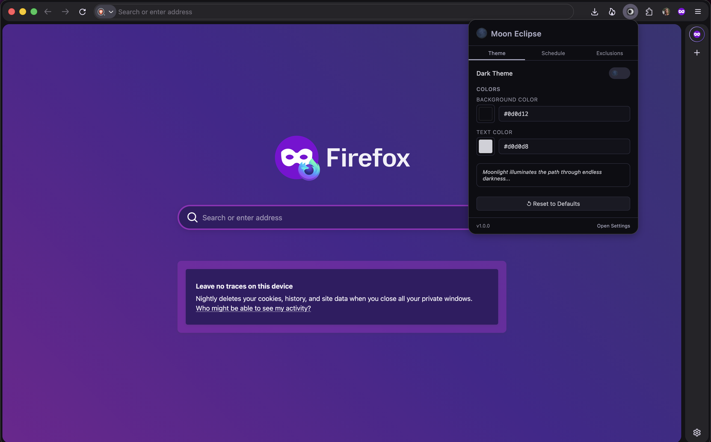
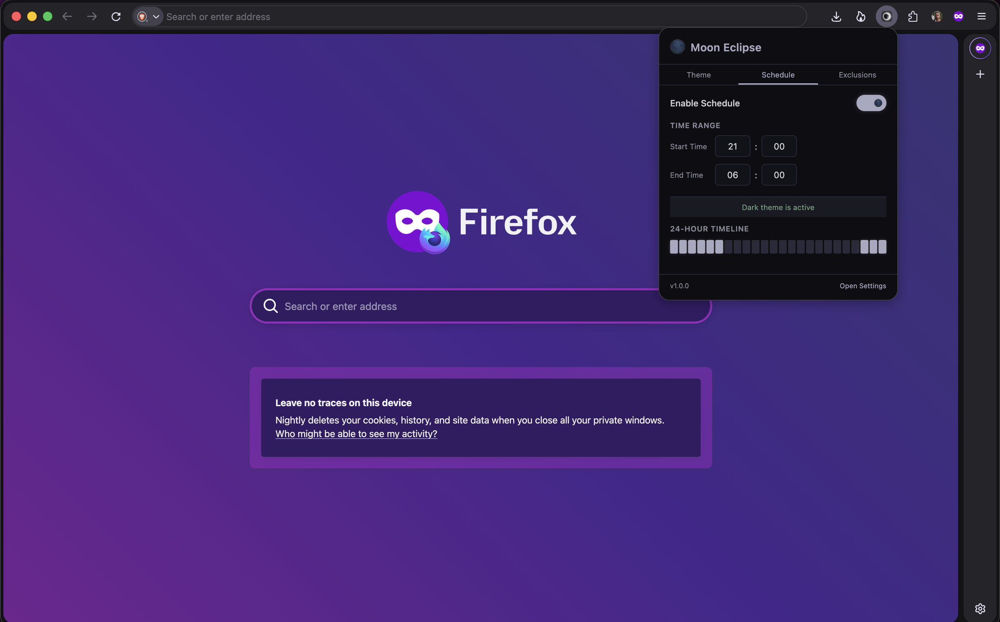
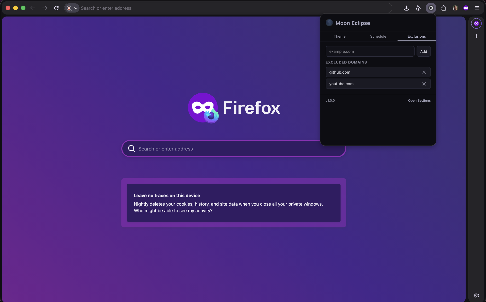

<p align="center">
  
</p>

<h1 align="center">Moon Eclipse</h1>

<p align="center">Dark theme for any website — lightweight, fast, lunar-inspired.</p>

Moon Eclipse injects carefully crafted CSS rules to transform any website into a comfortable dark theme. No DOM traversal, no observers, no performance overhead.

## Features

- One-click toggle from the popup
- Customizable background and text colors with a built-in HSV picker and hex input
- Per-site exclusion list with one-click domain add
- Daily schedule with overnight range support
- Works instantly — no page flicker

## Screenshots

| Theme | Schedule | Exclusions |
|---|---|---|
|  |  |  |

## Install

### From Firefox Add-ons

Install directly from the [Firefox Add-ons store](https://addons.mozilla.org/en-US/firefox/addon/the-moon-eclipse/).

### From Source

```bash
git clone https://github.com/gdmad/moon-eclipse.git
cd moon-eclipse
npm install
npm run build
```

Then in Firefox: `about:debugging` > "Load Temporary Add-on" > select `release/manifest.json`.

## Development

```bash
npm run build     # one-time build -> release/
npm run watch     # watch mode, auto-rebuild
npm run package   # build + zip for release
```

### Stack

- TypeScript + esbuild (IIFE bundles)
- browser.storage.local for settings
- browser.alarms for scheduling
- Manifest V2, Firefox-only

### Project Structure

```
src/
  background/   # Service Worker, CSS generator, color utils, scheduler
  content/      # Content script — injects/removes <style> tag
  popup/        # 350x500px popup UI (the only UI surface)
  shared/       # Types, storage, custom color picker, settings UI component
```

## Permissions

| Permission | Why |
|---|---|
| `storage` | Save user settings |
| `alarms` | Schedule on/off times |
| `activeTab` | Pre-fill current domain for exclusion |
| `http://*/*`, `https://*/*` | Inject dark theme CSS |

## License

MIT — see [LICENSE](LICENSE).
